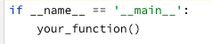

# Python Engineering
In this training session you get the chance to familiarise yourself with the many different aspects of ML engineering and software engineering.
As discussed during the presentation, the type of application that you're going to build today looks as follows:

Before we dive into building the application, we need to set up the environment. If you followed the instructions in the preparation e-mail, then this should be easy
and you can probably get started straight away. 

---
## Exercise 0: Environment
Before we can start, you'll need to set up your working environment. Additionally, we're going to install the skeleton of the application in our Python environment. This makes it easy to develop.
- Download or clone this git repository
- Set up your environment in PyCharm. You can use Conda for this, see [this](https://docs.anaconda.com/anaconda/user-guide/tasks/pycharm/) link.
- Install the dependencies from the setup.py file (use `pip install -e .` in your project folder). You will need to run this command from a PyCharm terminal
- Try to run the `uvicorn main:app --reload` from the terminal in PyCharm. This should start the API and provide you with a link.

### Checkpoint
At the end you should have a PyCharm installation with the project cloned to a folder on your computer. You should have this folder loaded in PyCharm and have a Python environment with the setup.py file installed. You can do these steps from the command line.

---
## Exercise 1: Project Structure

- We're going to need a few modules to build our application. The following modules are at least required:
    - data -> this module is responsible for data handling
    - model -> this module is responsible for all model related work
    - api -> this module is responsible for the API handling
- Create the modules in the project tree. You can use PyCharm for this, or do it by hand. Note: if you create these folders, modules always require an `__init__.py` file in **each** the directory. This is needed so that the Python interpreter can discover the files in the modules.

### Checkpoint
You should now have a project with three modules in your application directory. Each directory contains an `__init__.py` file. 

---
## Exercise 2: Get the basic API up and running
The goal of this exercise is to familiarise yourself with the FastAPI interface and the Swagger UI. It's important to get comfortable with how things work. It will make it easier to implement new cool things further on.

#### Steps
- Explore the `main.py` file in the main directory. You can see there is a function available that describes the `hello` endpoint. Endpoints in FastAPI are **functions** annotated with a _decorator_ (`@app.get("/hello")`). `Hello` is one of the endpoints you can interact with. Let's first start the API. For this you need to open your terminal in PyCharm (make sure you're in the right python environment) and run:
  `uvicorn main:app --reload`

  If the command is successful, you should be able to navigate to the webserver `https://127.0.0.1:8000/hello`.

- Try to modify the returned value in `main.py`, save the file and visit the webpage once more. The API will reload on save (this is why we added the `--reload` flag in the previous step).

- What HTTP method is used for the `hello` endpoint?

- Visit `https://127.0.0.1:8000/docs`. This is what we call the "Swagger UI" it contains the OpenAPI specifications for your API. It's a nice page because it allows you to interact with your API. It also lists the inputs that are expected for each endpoint!

- Use the try-out functionality to send a `GET` request to your `/hello` endpoint.

- Check out the console where you are running the API from (you probably have started the API from PyCharms terminal). Can you see the request in the logs?

### Checkpoint

A this point you should be able to run the API on your machine and interact with it. You're able to see the logs in the terminal and inspect the Swagger documentation.

Now that you have the API up and running, it's time to start adding components to build the components that we want!

---

## Excercise 3: Data Loading

The first module that we'll create is the data loader. We'll use the build-in datasets in scikit-learn to make things easier. They offer datasets that are available straight from the package itself, this way we don't have to bother with data prep today.

**This exercise section consists of the following steps:**

- Create some helper functions to load data
- Write unit tests for these functions
- Run the tests from your command line

#### Creating the data loader function

- We'll be using the [following](https://scikit-learn.org/stable/modules/generated/sklearn.datasets.load_iris.html#sklearn.datasets.load_iris) dataset
- Create a new Python file in the data module, give it an appropriate name, this will contain your data loading functionality.
- Create a function with an appropriate name that <u>returns</u> the `X` and `y` of the `iris` dataset. You need to import some dependencies, check the scikit-learn documentation link for this.

#### Write unit tests for the data loader function

- Remember the directory structure. Tests are **always** located in the tests folder. The tests folder must follow the same structure as your project folder (same directory structure).
- Create a file in the `tests/data` directory and call it `test_{ your file name}.py` Note that name of your test file must match with the file name in your data module. If your file is called `load_data.py` then your test file should be called `test_load_data.py`.
- After you've created the file, you will need to import the function that you want to test. You can do this by importing your own package. For instance `from data.load_data import your_function_name`
- If you're having troubles importing, right click on the `src` directory and go to `mark directory as` -> `mark as sources root`. This will help python to discover your files.
- Think of what you want to test of your function. This is crucial and forces you to think about the behavior of your function. You can use this link as a starting point: https://docs.pytest.org/en/6.2.x/assert.html#assert
- Write a unit test for your data loader function. _**Hint**: what does your function return and how can you check if that's actually the case?_

#### Run the tests from the command line

- Once you've finished writing your test or tests, you can open a new terminal in PyCharm and write `pytest tests`. Make sure you're in the project root directory.
- If your tests are successful, you will see that all tests have passed.
- Write a test that will surely fail and rerun the tests again, see how `pytest` changes the output.

### Checkpoint
If you've made it this far, you're doing really good! You're able to write a function in the appropriate module. You are able to test the function and operate on the command line. You've thought about what this function needs to do and what it shouldn't do.

Running these tests is something that developers typically do before committing code to the code base. Also, some developers take it to the next level by first writing a test, and then writing the code. This paradigm is called **test driven development**. See https://en.wikipedia.org/wiki/Test-driven_development for more information.

---

## Exercise 4: Model Training

In this section we'll write some code to train a simple scikit-learn model. The result of this section should be the following things:

- A function that trains a model on some provided data (loaded via our data loader).
- A "wrapping" function that performs data loading, model training and model storing

[//]: # (- A function that stores this model in the `models` directory)
- **Optionally**: unit tests for all functions. If you're having troubles with the code, you might want to do this later if you're more interested in the exercises ahead. If you're feeling comfortable, have a go at this.

#### Note:

- I've provided you with two functions in the `models/utils.py` file. These functions are useful for saving and loading models. 

#### Training functionality

I'm deliberately reducing how specific the instructions are the further you get. This allows you to more freely solve the problems at hand.

- Add a new Python file `train.py` under the `model` module. This file will contain the bits that are using for model training.

- Remember that you need data to train a model, so you'll need to use your data loader to make the data available in this module.

- Write a functions to train a scikit-learn model. You know the type of data that we have, so you can pick an appropriate model.

- Write a function your other functions such as data loading, model training and model storing. Use the `save_model` function in your `train` module to make sure that we can store the model on disk. We'll need it for the API!

- You can run your python script from the command line by adding the following code to the bottom of your script.

  

- Make your `train.py` file executable by adding the name equals main statement.

- If you're going fast, feel free to add some unit tests for your new code. Otherwise, skip ahead to the next part

### Checkpoint

You now have a module `train.py` that loads data, trains a model and saves it to disk. You're able to run the `train.py` script and it outputs a model in the directory that you expect. If this is not the case, revisit the steps until you meet these requirements. Feel free to ask help at any time!

---

[//]: # (## Exercise 5: Model predict)

[//]: # ()
[//]: # (In this section we're going to use the stored trained model to make some predictions. For this we'll need a few things.)

[//]: # ()
[//]: # (- A stored trained model)

[//]: # (- A function that loads this model from disk)

[//]: # (- A function that uses a model to produce predictions)

[//]: # (- A feature vector or sample of data to make predictions on)

[//]: # ()
[//]: # (In the `utils.py` I've provided you with a function to load a model from disk. So, at this point you should have a stored trained model and a function to load it. That means we have to create the other two bits to complete this exercise.)

[//]: # ()
[//]: # ()
[//]: # (### Create a predict function)

[//]: # (Predict should be part of the `model` module. Create a new file there for the predict functionality.)

[//]: # ()
[//]: # (#### Steps)

[//]: # (- Write the function to make predictions using the stored model. There are multiple ways how you can solve this.)

[//]: # (- Write a test that tests your prediction functionality)

[//]: # (- Run **PyTest** to validate if everything passes. If you're short on time but you)

[//]: # (---)

## Exercise 5: Create prediction endpoint

We now have a trained model and an API that is not doing much at the moment. The next step is to create an endpoint in the API where we can call the predict function of our model object. Since the model is trained, you can load it and call `model.predict()` on it to produce predictions. How convenient!

These are the steps you'll need to work through. Remember to run the API, inspect the documentations and check the endpoint as often as you want! This is a nice way to learn how everything works together.

To create predictions you'll need a feature vector. This should be something that is passed as data to the endpoint. Since endpoints are defined as functions, the feature vector is just an argument to the function.

**Note:** the `main.py` file contains a `logger` variable. You can use `logger.info("your information")` to log data to the console. That's useful for inspecting stuff such as requests and predictions!

### Create the endpoint and interface
#### steps
- Create a new **endpoint** in main.py, let's call `predict`. This will be a POST operation!

- To pass the feature vector as an argument, we'll need to define an interface. Luckily for us, `Pydantic` and `FastAPI` make this really easy. An interface is nothing but a description of the input data that you expect for the endpoint. We can define it in a python class. Use the following walkthrough to set up an interface for our feature vector (iris dataset): https://fastapi.tiangolo.com/tutorial/body/#import-pydantics-basemodel

- You can define this interface under the `api` folder in a separate file, or you can put it in the `main.py` until everything works nicely together.

- Once you've defined the interface, you can add it to the endpoint like so: `predict(data: YourInterfaceName)`. The colon notation is called a **type hint**. It basically explains what the data object should look like. Using type hints in your code has all kinds of benefits, but to keep this training a bit simpler, we've been omitting it.

  If you would like to learn more about it, [here](https://towardsdatascience.com/type-hints-in-python-everything-you-need-to-know-in-5-minutes-24e0bad06d0b) is a 5 minute summary about type hinting in Python. 

### Bringing it together
The one thing that's left to do is to actually fill the predict endpoint function with the predictions steps. There is just one catch here, loading the model. We don't want to access the disk and load the model every time someone files a request. This is not efficient. So, instead you'll need to load the model in the global namespace. This means that you'll need to call `model = load_model('model_name')` outside of any function in `main.py`. This way it's available in memory, even when the function ends!
#### Steps
- Load the model in the global namespace in `main.py`
- use the model to make a prediction in the prediction endpoint
- Make sure your API runs, open de Swagger UI (https://localhost:8000/docs) and test your predict endpoint

---

## Exercise 6: Flow control in your API 
In this exercise we'll perform some flow control inside a request. This means that we will inspect the request and based on some condition
we'll trigger a process in the backend. 

#### Steps
- Let's change our request structure to contain a field `test`, this should be a boolean value
- If test is true then we'd simply want to return the value 42, if test is false, then we need to return a prediction instead.

---

## Exercise 7: Caching - The I've done this before situation
In this exercise we'll create a simple cache. This cache should be used to check if we made a prediction before, and if so: we return the cached value instead.
In practice you would use an external storage as cache, something like Redis for instance. For this exercise we'll instead use a Python list instead. We will initialise the cache in the main file.

#### Steps
We'll start out by something really simple, and we'll build it up to something nicer.
- Create a list in the `main.py` file called `cache`
- Every time we make a prediction, we need to check if the prediction is already in the cache. Based on that we can do two things:
  - We've made this prediction before, so now we'll return the cached value
  - We haven't made this prediction before, so now we'll make the prediction, store it in the cache and return it to the requester.
  - Create an endpoint to view the current cache. Given that it's a read action, what HTTP method would you typically use for this?

---

## Exercise 8: (Optional) Add your own functionality
If you've made it this far today, you're ahead of the curve. Time to put your skills to work. Some suggestions of what you could be adding
- Create an endpoint to retrain the model on demand and version older models. 
- Create an endpoint to evaluate an existing model
