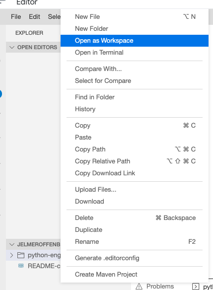

# Python Engineering
In this training session you get the chance to familiarise yourself with the many different aspects of ML engineering and software engineering.
As discussed during the presentation, the type of application that you're going to build today looks as follows:

## VSCode in the cloud
This is the preferred approach. You can use a full-fledged code editor in the cloud, free to use. You just need a Google account. Using a local environment is possible, but there have been problems in the past, specifically with Windows devices.

### Steps:
- Log on to: https://console.cloud.google.com/
- Click on "activate cloud shell"    
- Click on "open editor"    
- Open a new terminal and enter: `git clone https://github.com/JelmerOffenberg/python-engineering`. This will clone the repository in your working directory. You should see a folder appear on the left.
- Right-click on the folder and click "open as workspace"    
- Your workspace should look something like this:    
- You can install your application by running `make install` in the terminal
- You can run the API by typing `make run`
- You can view your API by launching a web preview. Make sure to change the port to 8000 (required once).   
- To view the documentation, replace the part at the end of the URL (after the `/` with `/docs`)

### Checkpoint
At the end you should have a working environment in the cloud. The exercises are located in the `exercises.md` file. You can find the exercises [here](exercises.md).
