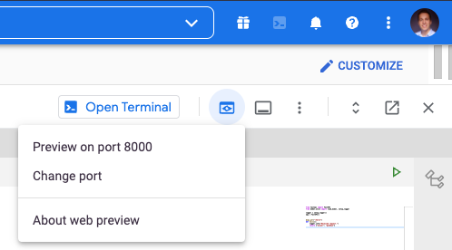

# Python Engineering - FastAPI
In this training session you'll build a simple API using FastAPI. FastAPI is a lightweight Python framework for building APIs. It's easy to use, and it's very fast. It's also very well documented. You can find the documentation [here](https://fastapi.tiangolo.com/). Make sure you use the documentation if you get stuck, it provides tons of examples, and it's very easy to follow.


### Exercise 1: Get the basic API up and running
Explore the `main.py` file in the main directory. You can see there is a function available that describes the `hello` endpoint. Endpoints in FastAPI are **functions** annotated with a _decorator_ (`@app.get("/hello")`). 

`Hello` is one of the endpoints you can interact with. Let's first start the API. Run `bash start.sh` from the terminal if you're running in the cloud to start the API.

If the command is successful, you should be able to navigate to the webserver. Use the web preview if you're working in the cloud. It's possible that you get an error the first time. Make sure to remove anything that comes after the `/` in the URL and just add `/docs` to the end. This will show you the documentation for your API. 
<br>
 <br>

---

### Exercise 2: Create your first API request
- Go to the web preview from the previous exercise. This is what we call the "Swagger UI" it contains the OpenAPI specifications for your API. It's a nice page because it allows you to interact with your API. Via an interface. It also lists the inputs that are expected for each endpoint!
- Use the try-out functionality to send a `GET` request to your `/hello` endpoint.
- Check out the console where you are running the API from. Can you see the request in the logs? 
<br>


---

### Exercise 3: Retrieving data via your API
In this exercise we'll mimic a simple database look-up in the API. In practice, you would probably use an external database for storing your information. However, for this exercise we'll use something much simpler: a python `dictionary` or a self-defined class/object. This way we're in full control of what's happening, and we can quickly experiment.
<br>


---

**The goal of this exercise is to create a simple data store:**
- Create an object and use it as a temporary data store. This data will exist in memory for as long as the API is running. It's a good way to test your application. You can decide what your data store looks like. If you're familiar with Python programming, try to create a Database class with the appropriate methods/functions that you can use to store your data.
- Update the endpoint so that it returns the value from the dictionary. You can use the Database object that you created in the previous step.
- Remember: If your Python skills are a bit rusty, you can also play around in this notebook or in the Python console to try out some code. It's easier to experiment first, then implement it in the API.
- When you've implemented this change, access the API user interface to see if everything is working as expected.

**bonus:** <br>
If you managed to do this with a dictionary, try to implement it with a class/object. This is a bit more advanced, but it's a good way to get familiar with Python classes and objects.

---

### Exercise 4: Inserting data via your API
In the previous exercise, we did a look-up in our fake database. In this exercise I want you to extend the functionality of your API so that you can also write data to your database. 

### Exercise 5: Deleting data via your API
Further extend the functionality of your API so that you can also delete data from your database. After this you're able to Create, Read and Delete data from your database. These operations are all part of an acronym called CRUD. It stands for Create, Read, Update and Delete. These are the basic operations that you can perform on a database. It directly maps back to the HTTP methods that we've discussed in the presentation. 

---

### Exercise 6: Schemas for input

We'll now improve your POST endpoint. It's a best practice to limit the type of data that you can insert into an API. This ensures that the API is used how we want, and that the data that we receive is in the proper format. Remember, we're building an API, so we want to make sure that the data that we receive is in the proper format. We decide what the proper format is.

We'll use `pydantic` for defining a schema for the input parameter. There is a simple example on how to make a schema for your endpoints in the docs, located [here](https://fastapi.tiangolo.com/tutorial/body/#import-pydantics-basemodel).

**The goal of this exercise to create a schema for the input parameters of your POST endpoint:**
- Create a schema for the input parameters of your POST endpoint. You can use the example from the docs as a starting point.
- Update the endpoint so that it uses the schema that you created.
- Remember: If your Python skills are a bit rusty, you can also play around in this notebook or in the Python console to try out some code. It's easier to experiment first, then implement it in the API.
- When you've implemented this change, access the API user interface to see if everything is working as expected.

---

### Exercise 7: Caching in the API
In this exercise we'll create a simple cache. A cache is a place where we store data that we've already seen before. This way we can avoid doing the same calculations over and over again. Think about how you would implement this from a logical perspective. In practice, you would probably use a database for this, but for this exercise you can use a list, dictionary or a class/object of your preference.

**The goal of this exercise is to create a simple cache:** <br>
Every time we make a prediction, we need to check if the prediction is already in the cache. Based on that we can do two things:
  - We've made this prediction before, so now we'll return the cached value
  - We haven't made this prediction before, so now we'll make the prediction, store it in the cache and return it to the requester.

Based on these requirements, create a simple cache system. How you implement the cache is up to you. You can use a dictionary, list or any other data structure that you like. You can also use a class/object if you want to.

If you use a class/object, you can use the following methods:
  - `get(key)`: This method should return the value for a given key. If the key is not in the cache, it should return `None`.
  - `set(key, value)`: This method should store a value for a given key. If the key is already in the cache, it should overwrite the value.


---

### Exercise 8: Create an endpoint to view your cache
An API allows you to expose various bits of information to your user. In the previous exercise we've created a cache. In this exercise, implement a simple endpoint that returns the current cache so that we can see what's in it.

### Bonus exercises:
These exercises are optional, but they're a good way to get familiar with FastAPI. They are in no particular order, some of them can be quite hard (such as the docker one). If you have time left, try to implement one or more of the following exercises:


- Implement a simple logging system. Every time a prediction is made, log the input and the output in a file. You can use the `logging` module for this. You can find the docs [here](https://docs.python.org/3/library/logging.html).
- If you're a bit familiar with docker, try to create a docker image of your API. You can find the docs [here](https://docs.docker.com/engine/reference/commandline/build/).
- Implement a simple user authentication for your API. 
- Load a scikit-learn machine learning model from disk and serve it in your API. For test data, you can use the iris dataset. You can find the docs [here](https://scikit-learn.org/stable/modules/generated/sklearn.datasets.load_iris.html). You can train a model using the following code:
    ```python
    from sklearn.datasets import load_iris
    from sklearn.ensemble import RandomForestClassifier
    
    iris = load_iris()
    X, y = iris.data, iris.target
    
    clf = RandomForestClassifier()
    clf.fit(X, y)
    ```

